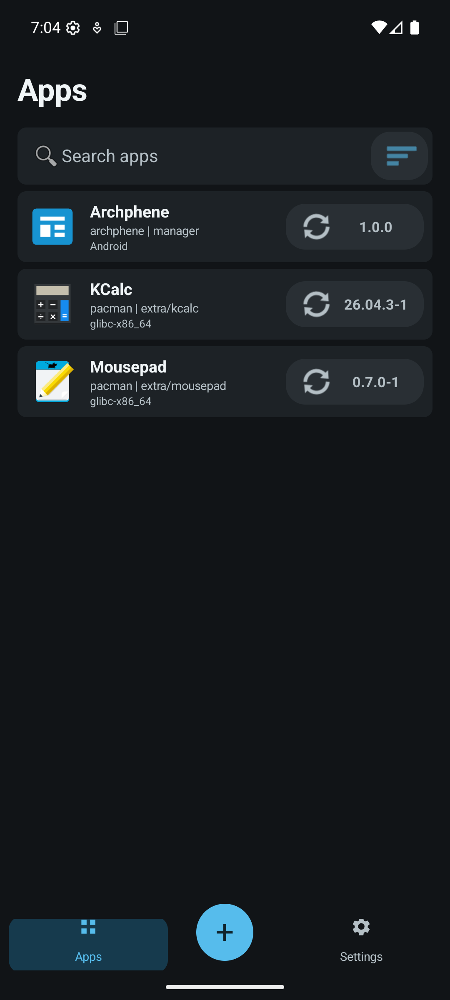

# Archphene

[](https://github.com/Nulifyer/Archphene/actions/workflows/publish-release-apk.yml)
[](https://github.com/Nulifyer/Archphene/releases/latest)
[](#tested-systems)

Archphene is a research project for running unmodified Arch Linux desktop applications as isolated Android applications, without a VM, root access, chroot, or OS modification.

Each wrapped Linux application receives a normal Android package identity, UID, private data directory, lifecycle, and permission boundary. An Android-owned Wayland bridge renders the Linux interface and brokers Android features such as input, clipboard, documents, themes, rotation, and freeform resizing.

> [!WARNING]
> Archphene is an active prototype, not a production application store. The manager now installs KCalc from a signed Arch transaction entirely on-device, but broad package, toolkit, ABI, and device compatibility is not complete. GrapheneOS-specific behavior has not been validated on a supported Pixel.

<p align="center">
  
</p>

## What works today

- Runs real, unmodified Arch Linux and Arch Linux ARM ELF application payloads as child processes of ordinary Android apps.
- Gives each Linux app a distinct Android package, UID, SELinux app domain, storage sandbox, launcher entry, and system install/uninstall flow.
- Renders Qt 6/KDE and GTK 3 applications through an app-local Wayland compositor.
- Accelerates OpenGL ES applications through a same-UID virpipe-to-Android EGL/GLES helper, with llvmpipe fallback.
- Supports touch and mouse input, hardware keyboard input, Android IME input, clipboard synchronization, popup menus, secondary dialogs, rotation, and live/freeform resizing.
- Maps Android light/dark mode into GTK and Qt/KDE applications.
- Brokers user-visible files through Android's Storage Access Framework while keeping background application state private.
- Exposes a Linux Home document provider for Android file managers and sharing workflows.
- Provides an Archphene manager UI with package search, update checks, version history, pinning, prerelease policy, repository settings, and Android-confirmed APK installation.
- Verifies package names, hashes, Arch signatures, signer continuity, version ordering, HTTPS sources, and download limits before opening an Android PackageInstaller session.
- Resolves, downloads, verifies, stages, closure-reduces, wraps, signs, and installs KCalc from Arch repositories at manager runtime; the manager APK contains reusable tools and bridge templates, not KCalc.

## Tested applications

| Application | Toolkit | Architecture | Tested environment | Status |
|---|---|---:|---|---|
| KCalc | Qt 6 / KDE Frameworks | x86_64 | Android 16 emulator | GUI, menus, keyboard, clipboard, theme, resize |
| KCalc | Qt 6 / KDE Frameworks | AArch64 | Samsung Galaxy S22 Ultra, Android 15 | GUI, menus, keyboard, clipboard, freeform resize |
| Mousepad | GTK 3 | x86_64 | Android 16 emulator | Editing, dialogs, IME, document open/save/reopen |
| GLMark2 | Mesa / Wayland | x86_64 | Android 16 emulator | Full suite, virgl host renderer, 1080x2205, score 12 |
| Archphene manager | Android | x86_64 | Android 16 emulator | Catalog, package transaction, versions, updates, settings, and production self-update |
| Archphene manager | Android | AArch64 | Samsung Galaxy S22 Ultra, Android 15 | Catalog, package transaction, Terminal publication, wrapper install, and KCalc launch |

These results prove the bridge on the listed targets only. They do not establish compatibility with every Android device, Linux application, GPU driver, or GrapheneOS release.

## How it works

```text
signed Arch package and dependency closure
                    |
                    v
        generated Android wrapper APK
        - Linux executable and runtime
        - Android Activity and permissions
        - Wayland and document bridge
                    |
                    v
          Android PackageInstaller
                    |
                    v
       separate Android UID and sandbox
                    |
                    v
 Linux process <-> Wayland bridge <-> Android UI
```

Android remains the installer and sandbox authority. The glibc compatibility patches only replace optional or blocked syscall forms needed during process startup. They do not grant permissions, bypass SELinux, or alter the Android kernel.

Official Arch Linux packages are used for x86_64. AArch64 testing uses the separate Arch Linux ARM repositories and signing keys.

## Install Archphene

Download the APK and checksum from [GitHub Releases](https://github.com/Nulifyer/Archphene/releases).

1. Download `Archphene-arm64-v8a-<version>.apk` for a normal ARM64 phone/tablet, or `Archphene-x86_64-<version>.apk` for an x86_64 Android system.
2. Verify it against the matching `.apk.sha256` file.
3. Allow your browser or file manager to install unknown applications when Android prompts.
4. Install the APK through Android's normal package installer.

Release APKs are signed with a dedicated persistent Archphene release key and are built with `android:debuggable="false"`.

The manager can generate and install the tested Qt/KCalc wrapper on x86_64 and AArch64 devices. Other packages remain subject to toolkit, ABI, page-size, bridge-capability, and wrapper-template compatibility checks; package search does not imply that every Arch package is currently runnable.

## Build from source

### Linux release build

Release CI builds the Arch runtime, patched glibc, wrapper template, isolated Terminal companion, and signed manager APK on Linux. The same-release-signed companion is embedded in the manager and installed through Android confirmation on first use. On Windows, the thin launcher runs those build phases inside Podman:

    ./scripts/build-manager-podman.ps1

Use `-SkipRuntime` for manager-only rebuilds and `-ReleaseBuild` for a locally production-signed APK.

Outputs: `prototypes/linux-app-manager-stub/out-linux/archphene.apk` and the embedded companion source artifact at `prototypes/archphene-terminal-app/out-linux/archphene-terminal.apk`.

### Windows emulator/device adapter

Windows is only the host adapter for Podman, ADB, emulator control, USB devices,
screenshots, and input automation. Arch package work, native compilation, glibc,
APK assembly, signing, and releases run in Linux.

```powershell
./scripts/install-apk.ps1 -Serial emulator-5554
```

Development builds use a persistent ignored debug key and remain debuggable for automated `run-as` tests. GitHub Releases use the separate non-debuggable release profile documented in [Publishing releases](docs/releases.md).

### Regression tests

The repository contains focused emulator and physical-device tests under `scripts/`. The broad entry points are:

```powershell
./scripts/test-emulator-regression.ps1
./scripts/test-arm64-physical-regression.ps1 -Serial <adb-serial>
```

The physical suite expects the curated ARM64 package/runtime workspace and a compatible attached device. Individual scripts cover manager workflows, package signatures, KCalc interactions, Mousepad documents, IME behavior, rotation, and update transactions.

## Current limitations

- The complete on-device KCalc/Qt transaction is proven on x86_64 and AArch64 with durable per-package jobs, list/detail progress, cancellation, retry, bounded parallel preparation, serialized signing/installation, isolated failures, and process-death reconciliation. Arbitrary packages still need broader toolkit detection, capability policy, wrapper templates, and compatibility reporting.
- GitHub Releases discovery, checksum validation, bounded download, signer/package verification, Android confirmation, replacement, and restart reconciliation are implemented. The commit-pinned Linux workflow builds into a draft and publishes independently signed and checksummed x86_64 and arm64-v8a APKs only after verification. Strict ABI selection passes on x86_64, 16 KB x86_64, and physical AArch64; the real `v1.0.1` workflow and live `v1.0.0` migration still need to run.
- KCalc and Mousepad now use one shared Android Activity/InputConnection/clipboard host and Rust native compositor. Broad application support still requires more protocols, toolkit templates, and device coverage.
- Verified package closures publish as manager-owned immutable content-addressed runtime packs. A caller-authenticated provider grants exact read-only modules to the generated wrapper UID, cold KCalc app-drawer launch is validated, untrusted shell access is rejected, unchanged closures are reused, and external uninstalls are reconciled per package. ARM artifacts support 4 KB/16 KB pages; upstream Arch x86_64 is 4 KB-only. Stable provider clients and Binder-death leases protect packs used by running wrappers and Terminal materialization. Managed launches use a dedicated process group, parent-death signal, cancellable execution registry, and final wrapper-UID descendant sweep.
- OpenGL ES command execution is accelerated through virpipe and Android EGL/GLES with software fallback. Final Wayland presentation still uses shared-memory copies; Vulkan, zero-copy dmabuf, and broader physical-device app tests remain incomplete. Private Pulse playback and explicit-consent microphone capture through Android AAudio are validated with unmodified `pavucontrol`/`pacat` clients on x86_64 and AArch64. XDG printing reaches Android's system print UI, and bounded plain-text plus brokered file drag-and-drop maps to standard Wayland data devices. A bounded explicit-consent Camera2 JPEG API is validated on x86_64 and AArch64; Android virtual accessibility semantics and reverse actions are also validated; a per-wrapper Android Keystore-backed encrypted secret API and private Secret Service D-Bus adapter are validated on both architectures, with unmodified Arch libsecret and KWallet clients passing on 4 KB x86_64. Streaming XDG Camera/PipeWire is validated with unmodified Snapshot on x86_64 and AArch64, and official Arch Linux ARM libsecret passes against the private Secret Service; AT-SPI2, the patched AArch64 KWallet daemon, and many desktop portals remain incomplete.
- Android permissions require explicit bridge APIs; a Linux syscall cannot directly trigger an Android runtime permission prompt.
- Secondary Linux toplevels use a shared parent/child registry with composited phone behavior and separate Android dialogs in tablet/freeform mode. Sustained vendor desktop-mode policy and multi-display behavior still need validation.
- GrapheneOS-on-Pixel, Android 16 KB page-size devices, and generic laptop hardware remain unvalidated.
- Archphene does not provide GrapheneOS firmware, verified boot, kernel hardening, or security updates on unsupported hardware.

See [Current project status](docs/project-status.md) for validated evidence and remaining work, and the [roadmap](docs/roadmap.md) for engineering order.

## Roadmap

1. Replace the validated virpipe-to-SHM presentation path with zero-copy Android hardware buffers/dmabuf where supported, while retaining software fallback and expanding application regressions.
2. Complete the AT-SPI2 accessibility adapter, then extend the validated patched KWallet compatibility daemon from 4 KB x86_64 to AArch64; official AArch64 libsecret is validated. Streaming XDG Camera/PipeWire, bounded Camera2 JPEG, Android virtual accessibility, and Android Keystore-backed secret transport plus private Secret Service D-Bus are validated; manager-owned GUI homes, active-app document activation, bounded plain-text and brokered file drag-and-drop, private XDG URL/notification/printing adapters, and Pulse-to-AAudio input/output are implemented.
3. Expand the proven failure-isolated x86_64/AArch64 package flow to broader toolkit templates and compatibility policy.
4. Generate Android manifests and permission brokers from package capabilities.
5. Expand compatibility to GPU-accelerated editors, browsers, creative applications, audio, and desktop/freeform multi-window use.
6. Validate supported GrapheneOS Pixels without claiming GrapheneOS-equivalent security on other devices.

## Repository layout

| Path | Purpose |
|---|---|
| `prototypes/linux-app-manager-stub/` | Archphene Android manager |
| `prototypes/kcalc-android-app/` | Qt/KDE wrapper and Wayland proof |
| `prototypes/mousepad-android-app/` | GTK wrapper and document workflow proof |
| `prototypes/shared-android-bridge/` | Shared Android Activity, input, clipboard, window, and JNI host |
| `patches/glibc/` | Android app-seccomp compatibility patches |
| `scripts/` | Build, package, emulator, physical-device, and regression automation |
| `docs/` | Current product, architecture, security, development, and release documentation |
| `research/` | Historical feasibility studies, experiments, source reviews, audits, and recovery evidence |

## Documentation

- [Documentation index](docs/README.md)
- [Architecture](docs/architecture.md)
- [Security model](docs/security.md)
- [Storage and documents](docs/storage.md)
- [Development](docs/development.md)
- [Roadmap](docs/roadmap.md)
- [Publishing APK releases](docs/releases.md)
- [Research archive](research/README.md)

## Contributing

The highest-value contributions are shared bridge improvements, protocol correctness, package verification, reproducible wrapper generation, Android permission/storage brokers, and automated compatibility tests.

Before adding application-specific workarounds, check whether the behavior belongs in the shared Wayland, runtime, storage, or permission layer. Include the target Android version, CPU ABI, package version, reproduction steps, and relevant logs in bug reports.

Read [CONTRIBUTING.md](CONTRIBUTING.md), [SECURITY.md](SECURITY.md), and [SUPPORT.md](SUPPORT.md) before opening a pull request or issue.

Use [GitHub Issues](https://github.com/Nulifyer/Archphene/issues) for reproducible bugs and focused design proposals.

## License

Archphene source code is licensed under the [MIT License](LICENSE). Vendored third-party code, Arch packages, prebuilt compatibility libraries, and generated artifacts retain their respective upstream licenses and notices.
