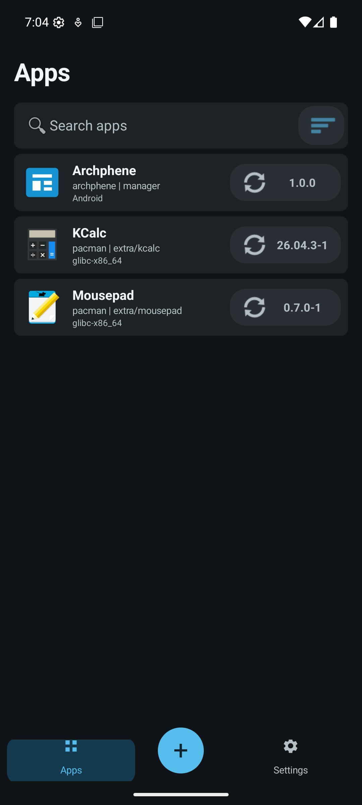

# Archphene

[](https://github.com/Nulifyer/Archphene/actions/workflows/publish-release-apk.yml)
[](https://github.com/Nulifyer/Archphene/releases/latest)
[](#tested-systems)

Archphene is a research project for running unmodified Arch Linux desktop
applications from one shared, user-owned Arch environment inside an ordinary
Android app, without a VM, root access, chroot, or OS modification.

Graphical desktop entries receive thin Android launcher APKs, but Linux
packages, processes, files, home, and tools remain in the manager-owned shared
root. An Android-owned Wayland bridge renders the Linux interface and brokers
Android features such as input, clipboard, documents, themes, rotation, and
freeform resizing.

> [!WARNING]
> Archphene is an active prototype, not a production application store. The
> published v1.0.1 and older Java prototype used separate per-wrapper runtime
> packs. The greenfield Rust + Kotlin implementation is replacing that model
> with the approved shared Arch root and is not yet feature-complete.

<p align="center">
  
</p>

## Greenfield implementation

The current `android/app` + `crates/` implementation has exact-ABI emulator and
physical Samsung coverage for:

- signed official-package search, resolution, shared-root install/remove, and
  durable recovery;
- one package-installed shared Bash environment and production terminal
  surface;
- Android DocumentsProvider, document import, folder grants, and initial
  project snapshots;
- persistent package activity, actionable failures, background work, adaptive
  manager navigation, and every planned package/launcher state;
- bounded shared-root desktop discovery and an atomic manager-owned launcher
  registry with package ownership, stable Android identities, and durable
  publication/removal generations;
- deterministic thin launcher APK assembly, Android Keystore signing,
  PackageInstaller confirmation, cold-start reconciliation, and
  launcher-only removal;
- an authenticated generated launcher running package-installed Foot from the
  shared AArch64 root, with private Wayland, density-aware logical output,
  physical-resolution subsurface composition, safe Android insets, Samsung IME
  text, clipboard, and live portrait/landscape Surface replacement;
- generic shared-root command resolution for installed `/usr/bin` tools and
  verified package-owned nested executables under paths such as
  `/usr/lib/<app>`, with real ELF and physical Samsung coverage.

Icon/capability derivation, x86_64 repetition of the real-client gate,
zero-copy/dmabuf presentation, broader toolkit coverage, and the remaining
production launcher capabilities are still open.

## Historical bridge evidence

The results below belong to the retained Java/C/Rust prototype. They prove
bridge feasibility and remain regression references, but its per-wrapper
runtime-pack architecture is not the production model.

- Runs real, unmodified Arch Linux and Arch Linux ARM ELF application payloads as child processes of ordinary Android apps.
- Gives each Linux app a distinct Android package, UID, SELinux app domain, storage sandbox, launcher entry, and system install/uninstall flow.
- Renders Qt 6/KDE and GTK 3 applications through an app-local Wayland compositor.
- Accelerates OpenGL ES applications through a same-UID virpipe-to-Android EGL/GLES helper, with llvmpipe fallback.
- Supports touch and mouse input, hardware keyboard input, Android IME input, clipboard synchronization, popup menus, secondary dialogs, rotation, and live/freeform resizing.
- Maps Android light/dark mode into GTK and Qt/KDE applications.
- Brokers user-visible files through Android's Storage Access Framework while keeping background application state private.
- Exposes a Linux Home document provider for Android file managers and sharing workflows.
- Provides an Archphene manager UI with package search, update checks, version history, pinning, prerelease policy, repository settings, and Android-confirmed APK installation.
- Verifies package names, hashes, Arch signatures, signer continuity, version ordering, HTTPS sources, and download limits before opening an Android PackageInstaller session.
- Resolves, downloads, verifies, stages, closure-reduces, wraps, signs, and installs KCalc from Arch repositories at manager runtime; the manager APK contains reusable tools and bridge templates, not KCalc.

## Tested applications

| Application | Toolkit | Architecture | Tested environment | Status |
|---|---|---:|---|---|
| KCalc | Qt 6 / KDE Frameworks | x86_64 | Android 16 emulator | GUI, menus, keyboard, clipboard, theme, resize |
| KCalc | Qt 6 / KDE Frameworks | AArch64 | Samsung Galaxy S22 Ultra, Android 15 | Current-source GUI, menus, calculation, light/dark/Material policy, rotation, lifecycle |
| Mousepad | GTK 3 | x86_64 | Android 16 emulator | Editing, dialogs, IME, document open/save/reopen |
| Mousepad | GTK 3 | AArch64 | Samsung Galaxy S22 Ultra, Android 15 | Current-source Preferences, accessibility, IME, Material You, document restart/writeback, lifecycle |
| Foot | Native Wayland | x86_64 | Android 16 emulator | UTF-8 IME, clipboard/selection, scrollback, live resize, lifecycle |
| Foot | Native Wayland | AArch64 | Samsung Galaxy S22 Ultra, Android 15 | Dark-mode UI, UTF-8 IME, clipboard/selection, wheel scrollback, resize, lifecycle |
| GLMark2 | Mesa / Wayland | x86_64 | Android 16 emulator | Full suite, virgl host renderer, 1080x2205, score 12 |
| Archphene manager | Android | x86_64 | Android 16 emulator | Catalog, package transaction, versions, updates, settings, and production self-update |
| Archphene manager | Android | AArch64 | Samsung Galaxy S22 Ultra, Android 15 | Catalog, package transaction, Terminal publication, wrapper install, KCalc launch, and production self-update |

These results prove the bridge on the listed targets only. They do not establish compatibility with every Android device, Linux application, GPU driver, or GrapheneOS release.

## Approved production model

```text
thin launcher Activity (separate APK/UID)
                    |
       authenticated Binder + Surface
                    |
                    v
 manager-owned Linux process and Wayland session
                    |
                    v
 one private shared Arch root and Linux home
```

Android remains the installer and outer sandbox authority. The launcher is an
entry point and Android UI host, not a second Linux container. See the
[architecture](docs/architecture.md) for the authenticated session and trust
boundaries.

Official Arch Linux packages are used for x86_64. AArch64 testing uses the separate Arch Linux ARM repositories and signing keys.

## Install Archphene

Download the APK and checksum from [GitHub Releases](https://github.com/Nulifyer/Archphene/releases).

1. Download `Archphene-arm64-v8a-<version>.apk` for a normal ARM64 phone/tablet, or `Archphene-x86_64-<version>.apk` for an x86_64 Android system.
2. Verify it against the matching `.apk.sha256` file.
3. Allow your browser or file manager to install unknown applications when Android prompts.
4. Install the APK through Android's normal package installer.

Release APKs are signed with a dedicated persistent Archphene release key and are built with `android:debuggable="false"`.

The manager can generate and install the tested Qt/KCalc wrapper on x86_64 and AArch64 devices. Other packages remain subject to toolkit, ABI, page-size, bridge-capability, and wrapper-template compatibility checks; package search does not imply that every Arch package is currently runnable.

## Build from source

### Greenfield Rust + Kotlin build

Build the exact ABI without downloading dependencies:

```bash
./scripts/build-archphene-app.sh --abi x86_64
./scripts/build-archphene-app.sh --abi arm64-v8a
```

The command requires the pinned local SDK/NDK, Gradle cache, and existing
network-disabled native container documented in
[development](docs/development.md).

### Historical release build

Release CI builds the Arch runtime, patched glibc, wrapper template, isolated Terminal companion, and signed manager APK on Linux. The same-release-signed companion is embedded in the manager and installed through Android confirmation on first use. The local Linux launcher runs those build phases inside Podman:

    ./scripts/build-manager-podman.sh

Use `--skip-runtime` for manager-only rebuilds and `--release-build` for a locally production-signed APK.

Outputs: `prototypes/linux-app-manager-stub/out-linux/archphene.apk` and the embedded companion source artifact at `prototypes/archphene-terminal-app/out-linux/archphene-terminal.apk`.

### Linux emulator/device workflow

Use ADB directly for emulator control, USB devices, screenshots, input automation,
and manager installation. Arch package work, native compilation, glibc, APK
assembly, signing, and releases all run in Linux.

```bash
./scripts/install-apk.sh --serial emulator-5554
```

Development builds use a persistent ignored debug key and remain debuggable for automated `run-as` tests. GitHub Releases use the separate non-debuggable release profile documented in [Publishing releases](docs/releases.md).

### Regression tests

The repository contains focused emulator and physical-device tests under `scripts/`. The broad entry points are:

```bash
./scripts/test-emulator-regression.sh --provision
./scripts/test-arm64-physical-regression.sh --serial <adb-serial>
```

`--provision` installs the required KCalc and Mousepad fixtures through real manager package transactions on an emulator; omit it when those fixtures already exist. The physical suite expects the curated ARM64 package/runtime workspace and a compatible attached device. Use `--skip-install` for a non-destructive run against already-installed fixtures. Signer migration is a separate explicit backup-and-confirm workflow, never an implicit test step. Individual scripts cover manager workflows, package signatures, KCalc interactions, Mousepad documents, IME behavior, rotation, and update transactions.

## Historical prototype limitations and evidence

This section documents the published/legacy implementation unless a bullet
explicitly names the greenfield manager.

- The complete on-device KCalc/Qt transaction is proven on x86_64 and AArch64 with durable per-package jobs, list/detail progress, cancellation, retry, bounded parallel preparation, serialized signing/installation, isolated failures, and process-death reconciliation. Arbitrary packages still need broader toolkit detection, capability policy, wrapper templates, and compatibility reporting.
- GitHub Releases discovery, checksum validation, bounded download, signer/package verification, Android confirmation, replacement, and restart reconciliation are implemented. The commit-pinned Linux workflow published independently signed and checksummed x86_64 and arm64-v8a `v1.0.1` APKs after verification. Live `0.9.0 -> 1.0.1` exact-ABI updates pass on the x86_64 emulator and physical AArch64 Samsung, and the published x86_64 `v1.0.0 -> v1.0.1` compatibility migration passes.
- KCalc and Mousepad now use one shared Android Activity/InputConnection/clipboard host and Rust native compositor. Broad application support still requires more protocols, toolkit templates, and device coverage.
- Foot's primary application and Bash closure pass on x86_64 and AArch64. Verified secondary commands are brokered through the managed loader; unpublished Android PATH commands fail closed rather than inheriting the incompatible glibc preload. A bounded policy for publishing optional dependency commands remains open.
- Verified package closures publish as manager-owned immutable content-addressed runtime packs. A caller-authenticated provider grants exact read-only modules to the generated wrapper UID, cold KCalc app-drawer launch is validated, untrusted shell access is rejected, unchanged closures are reused, and external uninstalls are reconciled per package. ARM artifacts support 4 KB/16 KB pages; upstream Arch x86_64 is 4 KB-only. Stable provider clients and Binder-death leases protect packs used by running wrappers and Terminal materialization. Managed launches use a dedicated process group, parent-death signal, cancellable execution registry, and final wrapper-UID descendant sweep.
- OpenGL ES command execution is accelerated through virpipe and Android EGL/GLES with software fallback. Complete GLMark2 runs pass on the x86_64 emulator and physical AArch64 Samsung; final Wayland presentation still uses shared-memory copies, while Vulkan, zero-copy dmabuf, and broader application coverage remain incomplete. Unexpected helper loss replaces the same-UID virgl helper and restarts the Linux payload once through virpipe without losing the Android Activity; bounded llvmpipe recovery remains only if helper replacement cannot recover. Private Pulse playback and explicit-consent microphone capture through Android AAudio are validated with unmodified `pavucontrol`/`pacat` clients on x86_64 and AArch64. XDG printing reaches Android's system print UI, and bounded plain-text plus brokered file drag-and-drop maps to standard Wayland data devices. A bounded explicit-consent Camera2 JPEG API is validated on x86_64 and AArch64. The private AT-SPI2 adapter maps unmodified KCalc/Qt and Mousepad/GTK semantics and reverse actions on x86_64 and AArch64. A per-wrapper Android Keystore-backed encrypted secret API and private Secret Service D-Bus adapter are validated on both architectures, including unmodified Arch and Arch Linux ARM libsecret/KWallet clients. Streaming XDG Camera/PipeWire is validated with unmodified Snapshot on x86_64 and AArch64; Vulkan, zero-copy presentation, and many desktop portals remain incomplete.
- Android permissions require explicit bridge APIs; a Linux syscall cannot directly trigger an Android runtime permission prompt.
- Secondary Linux toplevels use a shared parent/child registry with composited phone behavior and separate Android dialogs in tablet/freeform mode. Sustained vendor desktop-mode policy and multi-display behavior still need validation.
- GrapheneOS-on-Pixel and generic laptop hardware remain unvalidated. The manager, self-update path, shared compositor, and ARM64 runtime artifacts are exercised on 16 KB Android; upstream Arch x86_64 Linux packages remain 4 KB-aligned and are blocked on 16 KB x86_64 devices.
- Archphene does not provide GrapheneOS firmware, verified boot, kernel hardening, or security updates on unsupported hardware.

See [Current project status](docs/project-status.md) for validated evidence and remaining work, and the [roadmap](docs/roadmap.md) for engineering order.

## Roadmap

1. Replace the validated virpipe-to-SHM presentation path with zero-copy Android hardware buffers/dmabuf where supported, while retaining software fallback and expanding application regressions.
2. Broaden the validated AT-SPI2 and Secret Service integrations beyond current Qt/GTK, libsecret, and KWallet clients while retaining x86_64 and physical AArch64 regressions. Streaming XDG Camera/PipeWire, bounded Camera2 JPEG, Android virtual accessibility, Android Keystore-backed secrets, manager-owned GUI homes, active-app document activation, brokered drag-and-drop, private XDG URL/notification/printing adapters, and Pulse-to-AAudio input/output are implemented.
3. Expand the proven failure-isolated x86_64/AArch64 package flow to broader toolkit templates and compatibility policy.
4. Expand generated capability inference and Android brokers for broader application classes.
5. Expand compatibility to GPU-accelerated editors, browsers, creative applications, audio, and desktop/freeform multi-window use.
6. Validate supported GrapheneOS Pixels without claiming GrapheneOS-equivalent security on other devices.

## Repository layout

| Path | Purpose |
|---|---|
| `prototypes/linux-app-manager-stub/` | Archphene Android manager |
| `prototypes/kcalc-android-app/` | Qt/KDE wrapper and Wayland proof |
| `prototypes/mousepad-android-app/` | GTK wrapper and document workflow proof |
| `prototypes/shared-android-bridge/` | Shared Android Activity, input, clipboard, window, and JNI host |
| `patches/glibc/` | Android app-seccomp compatibility patches |
| `scripts/` | Build, package, emulator, physical-device, and regression automation |
| `docs/` | Current product, architecture, security, development, and release documentation |
| `research/` | Historical feasibility studies, experiments, source reviews, audits, and recovery evidence |

## Documentation

- [Documentation index](docs/README.md)
- [Architecture](docs/architecture.md)
- [Security model](docs/security.md)
- [Storage and documents](docs/storage.md)
- [Development](docs/development.md)
- [Roadmap](docs/roadmap.md)
- [Publishing APK releases](docs/releases.md)
- [Research archive](research/README.md)

## Contributing

The highest-value contributions are shared bridge improvements, protocol correctness, package verification, reproducible wrapper generation, Android permission/storage brokers, and automated compatibility tests.

Before adding application-specific workarounds, check whether the behavior belongs in the shared Wayland, runtime, storage, or permission layer. Include the target Android version, CPU ABI, package version, reproduction steps, and relevant logs in bug reports.

Read [CONTRIBUTING.md](CONTRIBUTING.md), [SECURITY.md](SECURITY.md), and [SUPPORT.md](SUPPORT.md) before opening a pull request or issue.

Use [GitHub Issues](https://github.com/Nulifyer/Archphene/issues) for reproducible bugs and focused design proposals.

## License

Archphene source code is licensed under the [MIT License](LICENSE). Vendored third-party code, Arch packages, prebuilt compatibility libraries, and generated artifacts retain their respective upstream licenses and notices.
